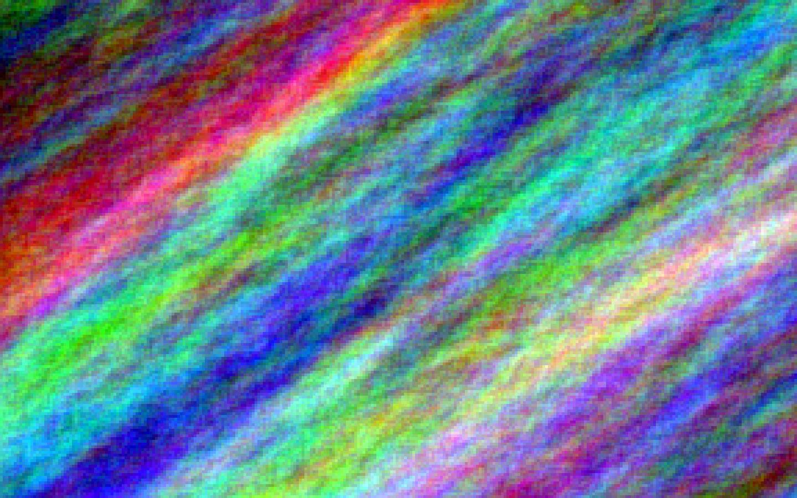

[](https://github.com/boyter/scc/#badges-beta)

# MarbleGenerator

## Need to be refactored to use maven

Generate a marble-like pattern to use in wallpapers.

Usage :
```
java -jar MarbleGenerator.jar [output file name] [width] [height] [size]
```

Optional arguments :
* 1 output file name :
  * name of the output file (without extension)
  * default is "wallpaper"
* 2 width :
  * width of image (square if no other arguments)
  * default is your screen width
* 3 height :
  * height of image
  * default is your screen height
* 4 size :
  * size of individual squares in the image
  * default is random between 3 and 12

It gives you something like this :



## Theory

Generate a matrix of random 3-tuples as following :


Initialize with a starting color, a slope vector and a variation vector :

![V_{0,0}=\[r_{0,0},g_{0,0},b_{0,0}\]](https://latex.codecogs.com/svg.latex?%5CLARGE%20V_%7B0%2C0%7D%3D%5Br_%7B0%2C0%7D%2Cg_%7B0%2C0%7D%2Cb_%7B0%2C0%7D%5D)

![S=\[s_{x},s_{y}\],s_{x}+s_{y}=1](https://latex.codecogs.com/svg.latex?%5CLARGE%20S%3D%5C%5Bs_%7Bx%7D%2Cs_%7By%7D%5C%5D%2Cs_%7Bx%7D&plus;s_%7By%7D%3D1)

![K=\[k_{r},k_{g},k_{b}\]](https://latex.codecogs.com/svg.latex?%5CLARGE%20K%3D%5C%5Bk_%7Br%7D%2Ck_%7Bg%7D%2Ck_%7Bb%7D%5C%5D)

Given a sigma function as following :


Compute each pixels with :


Compute output 3-tuples as color vectors and you have your final image.

![V_{x,y}=\[r_{x,y},g_{x,y},b_{x,y}\]](https://latex.codecogs.com/svg.latex?%5CLARGE%20V_%7Bx%2Cy%7D%3D%5C%5Br_%7Bx%2Cy%7D%2Cg_%7Bx%2Cy%7D%2Cb_%7Bx%2Cy%7D%5C%5D)
